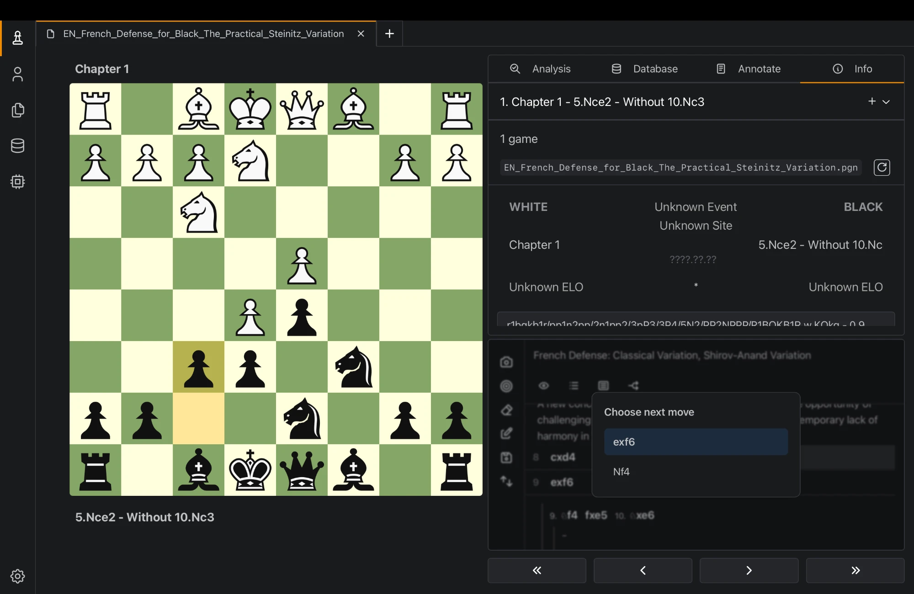
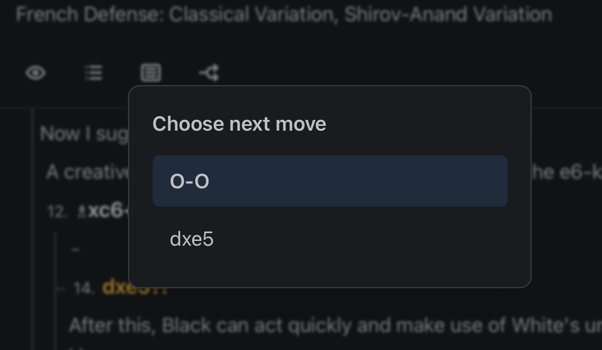

<br />
<div align="center">
  <a href="https://github.com/franciscoBSalgueiro/en-croissant">
    
  </a>

<h3 align="center">En Croissant</h3>

  <p align="center">
    The Ultimate Chess Toolkit
    <br />
    <a href="https://www.encroissant.org"><strong>encroissant.org</strong></a>
    <br />
    <br />
    <a href="https://discord.gg/tdYzfDbSSW">Discord Server</a>
    ·
    <a href="https://www.encroissant.org/download">Download</a>
    .
    <a href="https://www.encroissant.org/docs">Explore the docs</a>
  </p>
</div>

En-Croissant is an open-source, cross-platform chess GUI that aims to be powerful, customizable and easy to use.

## Features

- Store and analyze your games from [lichess.org](https://lichess.org) and [chess.com](https://chess.com)
- Multi-engine analysis. Supports all UCI engines
- Prepare a repertoire and train it with spaced repetition
- Simple engine and database installation and management
- Absolute or partial position search in the database


## Additions in this fork

This fork adds a **variation picker** for PGN navigation: when the current move has more
than one possible next move (a variation branch), stepping forward opens a floating picker
centered over the move list instead of silently following the mainline. Navigate the
options with →/↓ or ←/↑, confirm with Enter, or click one directly; Esc or clicking outside
dismisses it. Submitted upstream as
[PR #884](https://github.com/franciscoBSalgueiro/en-croissant/pull/884).




## Building from source

Refer to the [Tauri documentation](https://tauri.app/start/prerequisites/) for the requirements on your platform.

En-Croissant uses pnpm as the package manager for dependencies. Refer to the [pnpm install instructions](https://pnpm.io/installation) for how to install it on your platform.

```bash
git clone https://github.com/franciscoBSalgueiro/en-croissant
cd en-croissant
pnpm install
pnpm build
```

The built app can be found at `src-tauri/target/release`


## Contributing

For contributing to this project please refer to the [Contributing guide](./CONTRIBUTING.md).

## License

This software is licensed under GPL-3.0 License.
